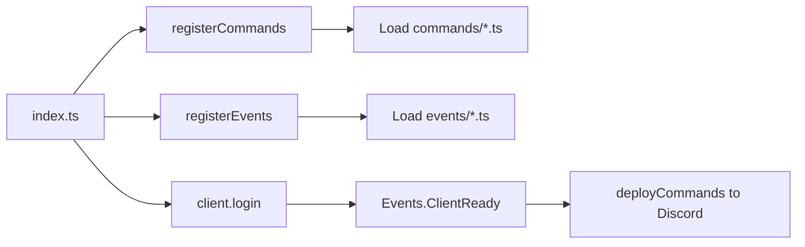

# Architecture

See [How it works](how-it-works.md) for a short walkthrough of startup and interaction flow.

## Entry point

[`src/index.ts`](../src/index.ts):

1. Reads `DISCORD_TOKEN` and `DISCORD_CLIENTID` (exits if missing).
2. Creates a Discord `Client` with intents `Guilds`, `GuildMessages`.
3. Calls `registerCommands(client)` — loads `src/commands/*.ts` into `client.commands`.
4. Calls `registerEvents(client, token, clientId)` — loads `src/events/*.ts` and attaches handlers.
5. Calls `client.login(token)`.

```typescript
const token = getEnv('DISCORD_TOKEN');
const clientId = getEnv('DISCORD_CLIENTID');
const client = new Client({ intents: [...] }) as CustomClient;
await registerCommands(client);
await registerEvents(client, token, clientId);
await client.login(token);
```

## Startup and command registration flow



On ready, the `ready` event runs once and calls `deployCommands()` ([`src/deploy-commands.ts`](../src/deploy-commands.ts)).

## Command flow

1. Discord sends `InteractionCreate`.
2. Handler in [`src/events/interactionCreate.ts`](../src/events/interactionCreate.ts) looks up the command by name in `client.commands`.
3. Calls `command.execute(interaction)` or `command.autocomplete(interaction)`.
4. On throw, replies with ephemeral error.

## Component and modal flow

Same `InteractionCreate` handler routes **modal submit**, **button**, and **string select** by `customId` via [`componentHandlers.ts`](../src/interactions/componentHandlers.ts). UI builders: [`src/interactions/builders.ts`](../src/interactions/builders.ts) — `buildModal`, `getModalFieldValues`, `buildButtonRow`, `buildStringSelect`. Handlers live in command files and are registered in `componentHandlers.ts`:

```typescript
export const COMPONENT_HANDLERS: Record<string, (i: Interaction) => Promise<void>> = {
  [FEEDBACK_MODAL]: handleFeedbackModal,
  [DEMO_BTN_PRIMARY]: handleDemoButtons,
  [DEMO_BTN_SECONDARY]: handleDemoButtons,
  [PICK_FRUIT]: handlePickFruit,
};
```

To add a command (with or without components), see [Building a command](building-a-command.md) or [Adding commands](commands/adding-commands.md). To add an event, see [Adding events](adding-events.md).

## Event flow

- **`Events.ClientReady`** (once) — Logs ready, then `deployCommands()`.
- **`Events.InteractionCreate`** — Dispatches to command `execute`/`autocomplete` or component handler by `customId`.

## Key types

[`src/@types/discordbot.ts`](../src/@types/discordbot.ts):

- **`CustomClient`** — `Client` with `commands` collection.
- **`DiscordCommand`** — `data` (SlashCommandBuilder), `execute(interaction)`, `autocomplete(interaction)` optional.
- **`DiscordEvent`** — `name`, `once?`, `execute` (event args + `token`, `clientId`).

**DiscordCommand** example:

```typescript
export default {
  data: new SlashCommandBuilder().setName('ping').setDescription('Reply with Pong!'),
  async execute(interaction: ChatInputCommandInteraction) {
    const latency = Date.now() - interaction.createdTimestamp;
    await interaction.reply({ content: `Pong! (${latency}ms)` });
  },
} as DiscordCommand;
```

**DiscordEvent** example:

```typescript
export default {
  name: Events.ClientReady,
  once: true,
  async execute(client: CustomClient, token: string, clientId: string) {
    await deployCommands(token, clientId, client);
  },
} as DiscordEvent;
```

## Other files

- **`src/deploy-commands.ts`** — Pushes `client.commands` to Discord on ready.
- **`src/interactions/`** — `helpers.ts` (`replyOrEditError`), `builders.ts` (UI builders), `componentHandlers.ts` (customId → handler map).
- **`src/data/`** — Optional static data; create if needed.
- **`src/delete.ts`** — Standalone script to clear registered commands.
