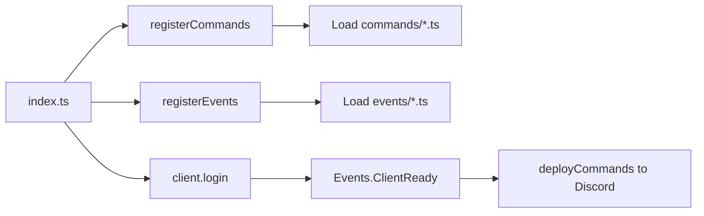

# Architecture

See also [How it works](how-it-works.md) for a short narrative walkthrough of startup and interaction flow.

## Entry point

[`src/index.ts`](../src/index.ts) is the entry point. It:

1. Reads `DISCORD_TOKEN` and `DISCORD_CLIENTID` from the environment (exits with an error if either is missing).
2. Creates a Discord `Client` with intents: `Guilds`, `GuildMessages`.
3. Calls `registerCommands(client)` — loads all command modules from `src/commands/*.ts` into `client.commands`.
4. Calls `registerEvents(client, token, clientId)` — loads all event modules from `src/events/*.ts` and attaches them to the client.
5. Calls `client.login(token)`.

## Startup and command registration flow

After login, when the client is ready, the `ready` event runs once and calls `deployCommands()`, which registers all slash commands with Discord's API (see [`src/deploy-commands.ts`](../src/deploy-commands.ts)).

## Command flow

When a user runs a slash command (one of the registered commands):

1. Discord sends an `InteractionCreate` event.
2. The handler in [`src/events/interactionCreate.ts`](../src/events/interactionCreate.ts) receives it.
3. For chat input commands, it looks up the command by name in `client.commands` and calls `command.execute(interaction)`.
4. If execution throws, the handler catches the error and replies to the user with an ephemeral error message.

For autocomplete interactions, the same handler looks up the command and calls `command.autocomplete(interaction)` if the command defines it.

## Component and modal flow

The same `InteractionCreate` handler routes **modal submit**, **button**, and **string select menu** interactions by `customId`. It looks up the handler in [`componentHandlers.ts`](../src/interactions/componentHandlers.ts) and runs it.

**UI builders** live in [`src/interactions/builders.ts`](../src/interactions/builders.ts): `buildModal`, `getModalFieldValues`, `buildButtonRow`, `buildStringSelect`. Use these to build modals, button rows, and select menus in your command's `execute`. Component handlers are implemented in the command files (e.g. `handleFeedbackModal`, `handleDemoButtons`, `handlePickFruit`) and registered in `componentHandlers.ts`.

**Component logic is colocated with commands**: each command that uses modals/buttons/select defines its customIds and handler in the same file and exports them; `componentHandlers.ts` imports from command files and builds the handler map.

Example commands that use these flows: **embed** (EmbedBuilder only), **feedback** (modal), **buttons** (buttons), **pick** (select menu), **choose** (autocomplete).

### Adding a command that uses components

1. Create the command file in `src/commands/`. Define your customIds in that file. In `execute`, build the UI using the builders from `src/interactions/builders.ts` (e.g. `buildModal`, `buildButtonRow`, `buildStringSelect`). Implement and export the submit/click/select handler in the same file (e.g. use `getModalFieldValues` for modals; for buttons/select, write an async function that reads the interaction and replies).
2. In [`componentHandlers.ts`](../src/interactions/componentHandlers.ts), import the handler and customId(s) from the new command and add the corresponding entries to `COMPONENT_HANDLERS`.

## Event flow

- **`Events.ClientReady`** (once) — Logs "Ready! Logged in as &lt;bot tag&gt;", then calls `deployCommands()` to register/update slash commands with Discord.
- **`Events.InteractionCreate`** — Dispatches to the matching command's `execute` or `autocomplete`; also handles modal submit, button, and string select menu by `customId`.

## Key types

Defined in [`src/@types/discordbot.ts`](../src/@types/discordbot.ts):

- **`CustomClient`** — Extends Discord's `Client` with a `commands` collection (command name → command module).
- **`DiscordCommand`** — Object with:
  - `data`: SlashCommandBuilder (name, description, options).
  - `execute(interaction)`: Promise<void>.
  - `autocomplete(interaction)`: Promise<void> (optional but typed).
- **`DiscordEvent`** — Object with:
  - `name`: Discord event name (e.g. `Events.ClientReady`).
  - `once?`: boolean — if true, the handler runs only once.
  - `execute`: (...args: [...ClientEvents[K], string, string]) => Promise<void> (event args plus token and clientId passed by the registerer).

## Adding a command

1. Create a new file in `src/commands/` (e.g. `mycommand.ts`).
2. Export a default object that implements `DiscordCommand`:
   - `data`: a `SlashCommandBuilder` with name, description, and options.
   - `execute(interaction)`: async function that handles the command.
   - `autocomplete(interaction)` (optional): if the command has options that support autocomplete.
3. The registerer will pick it up automatically on the next start; `deployCommands()` will register it with Discord when the bot becomes ready.

## Adding an event

1. Create a new file in `src/events/` (e.g. `guildMemberAdd.ts`).
2. Export a default object that implements `DiscordEvent`:
   - `name`: the Discord.js event name (e.g. `Events.GuildMemberAdd`).
   - `once`: set to `true` if the handler should run only once.
   - `execute`: async function with the same arguments as the event (the registerer passes through the client and optionally token/clientId for the ready event).
3. The registerer will attach it to the client on the next start.

## Other files

- **`src/deploy-commands.ts`** — Called on `ClientReady`. Uses the Discord REST API to push the current set of slash commands (from `client.commands`) to Discord. This is how slash commands appear in the client.
- **`src/interactions/`** — `helpers.ts` (error reporting via `replyOrEditError`). `builders.ts` (UI builders only: `buildModal`, `getModalFieldValues`, `buildButtonRow`, `buildStringSelect`). `componentHandlers.ts` imports handlers from command files and exports the customId-to-handler map used by the event.
- **`src/data/`** — Optional static data for your commands (e.g. list of options or responses). This folder does not exist by default; create it if you need it, then add modules and import them from command files.
- **`src/delete.ts`** — Standalone utility script to clear registered commands (both guild-specific and global). Useful for cleaning up during development or when removing the bot.
